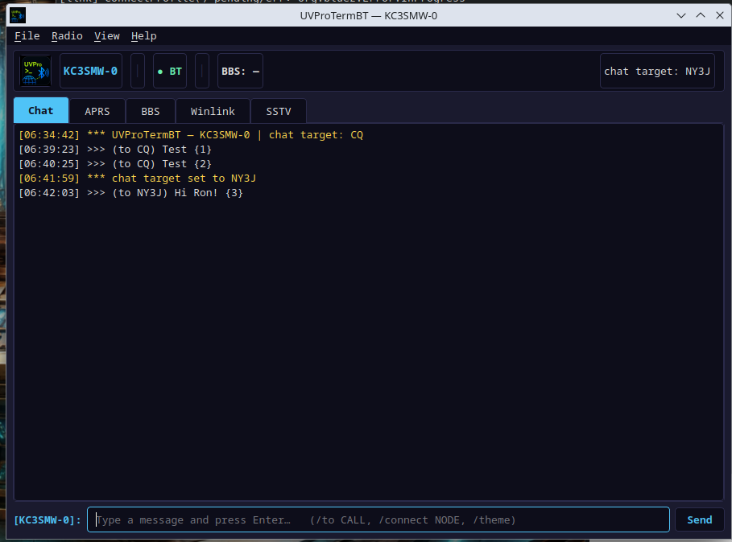
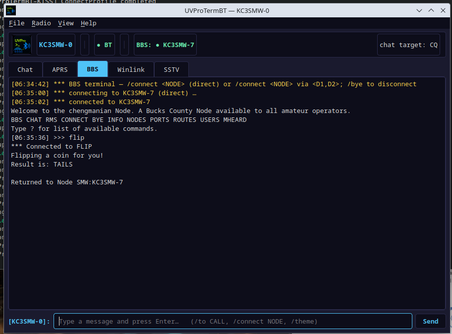
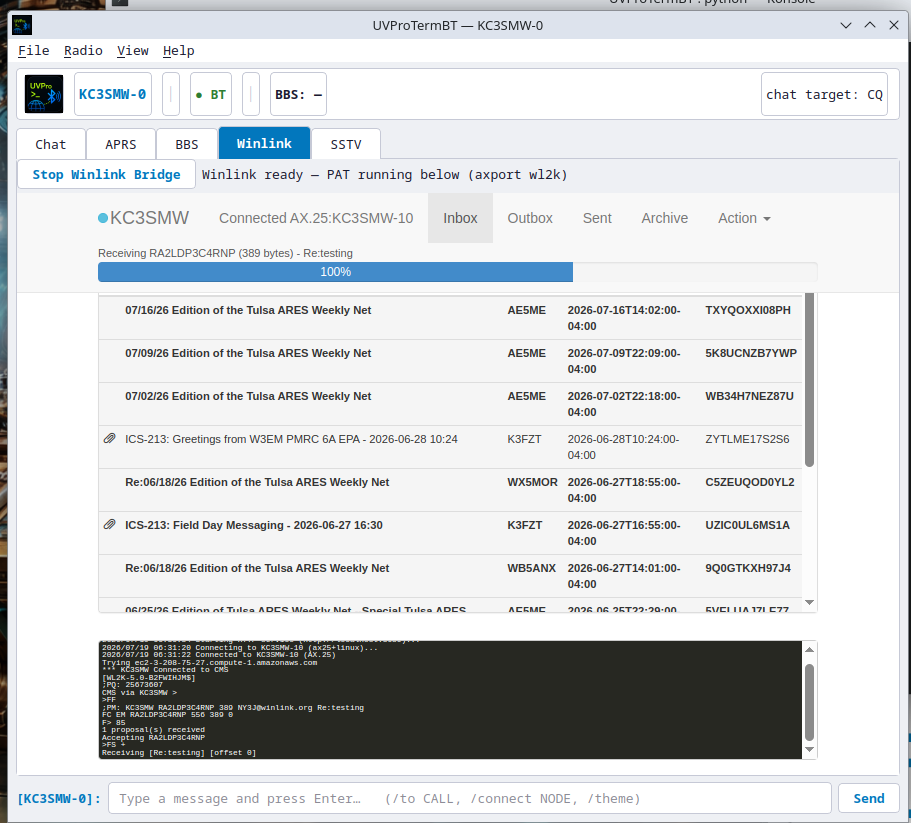
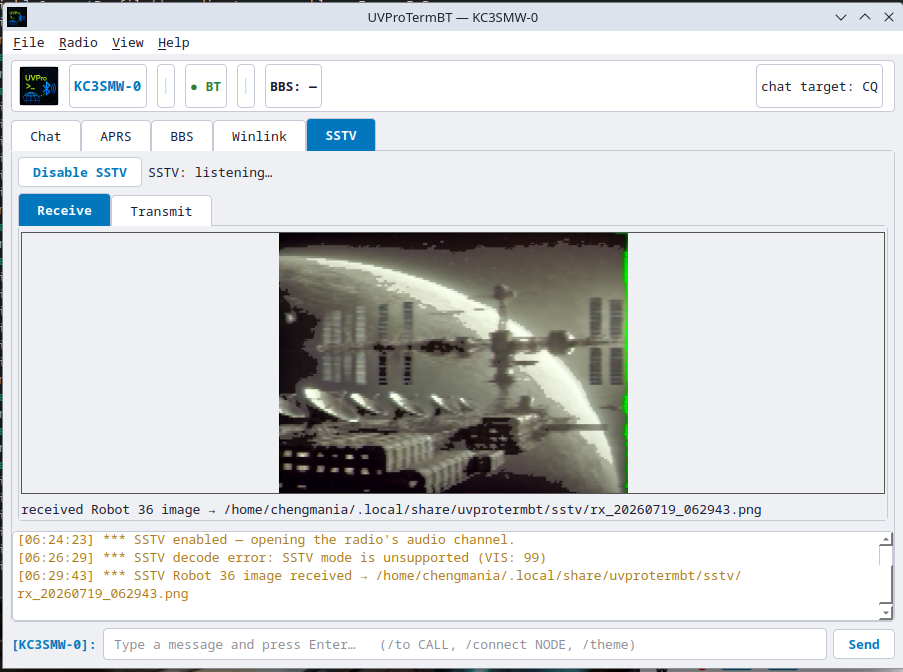
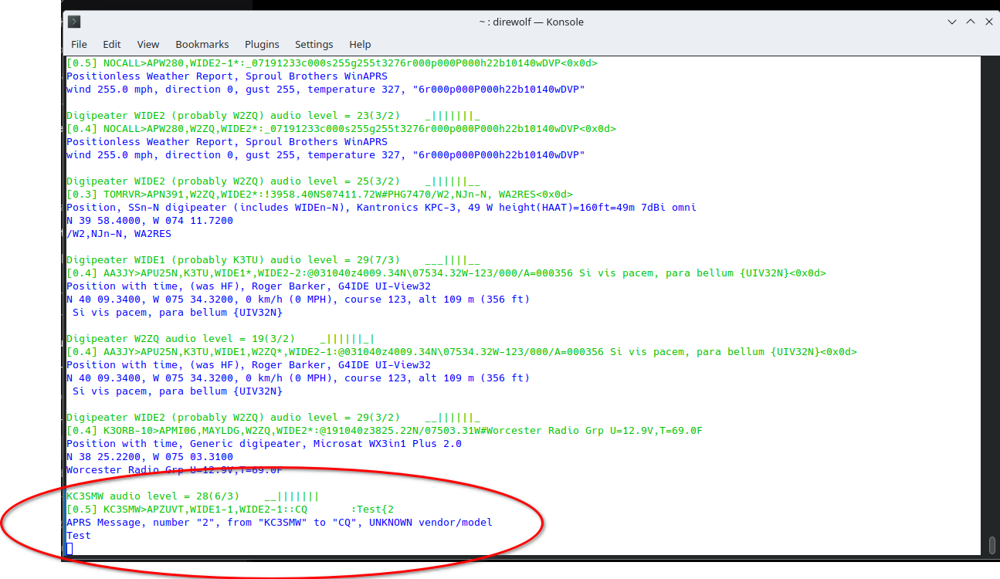

# UVProTermBT

A desktop **AX.25 packet messenger + terminal** for the **BTech UV-Pro** /
**VGC VR-N76** (the "Benshi" radio family), talking to the radio's built-in
**KISS TNC over classic Bluetooth** — no cable, no external TNC.

> **Install it now:** prebuilt `.deb` / `.rpm` / `.AppImage` builds for amd64
> and arm64 are on the
> [Releases page](https://github.com/9M2PJU/UVProTermBT/releases).
> See [Install & run](#install--run) below. *(Packaging added in v0.9.6.)*

Five modes in one PyQt6 window (styled after OpenWave), light/dark themes:

- **Chat** — SMS-style APRS messaging (send/receive, auto-ack).
- **APRS** — live monitor of decoded traffic + a heard-stations list.
- **BBS** — a full AX.25 connected-mode terminal (connect to BPQ/nodes).
- **Winlink** — brings up the kernel AX.25 port and embeds [PAT](https://getpat.io/)'s web UI in-window.
- **SSTV** — send and receive images over the radio's **Bluetooth audio channel**
  (Robot36 and more). Reverse-engineered from HTCommander; see
  [`docs/GAIA_AUDIO_SSTV.md`](docs/GAIA_AUDIO_SSTV.md). *(New in v0.9.5 —
  transmit + receive proven on air; needs `pysstv` + the SSTV decoder, see below.)*

> **Why this exists:** the usual Linux recipe for a Bluetooth KISS TNC
> (`kissattach /dev/rfcomm0`) does **not** work with this radio. Its KISS
> session is only served through BlueZ's **SerialPort profile**, reached via an
> SDP-negotiated connection — so UVProTermBT registers an `org.bluez.Profile1`
> and reads the RFCOMM fd BlueZ hands back. See
> [`docs/UVPRO_N76_KISS_LINUX.md`](docs/UVPRO_N76_KISS_LINUX.md) and
> [`docs/PROTOCOL.md`](docs/PROTOCOL.md) for the full story.

## Screenshots

| Chat (APRS messaging) | BBS terminal |
|---|---|
|  |  |

| Winlink (PAT embedded in-window) | SSTV (received image, auto-decoded) |
|---|---|
|  |  |

A Chat-tab APRS message transmitted by UVProTermBT, decoded by an independent
`direwolf` monitor — end-to-end on-air proof:



## Requirements

- Linux with BlueZ (developed on Kubuntu), Python 3.12+
- A BTech UV-Pro / VGC VR-N76 with **KISS TNC** firmware
- System BlueZ D-Bus bindings: `python3-dbus`, `python3-gi` (installed by `install.sh`)
- **Winlink only:** [PAT](https://getpat.io/) installed separately, plus a
  PolicyKit agent (KDE/GNOME provide one). `ax25-tools` is installed for you.
  Run `./run.sh --check` to verify everything Winlink needs is present.
- **SSTV only:** the SBC codec `libsbc1` (system), `pysstv` (encode, installed by
  `install.sh`), and the decoder
  `pip install git+https://github.com/colaclanth/sstv.git` (numpy/scipy; needs
  `libsndfile1`). Without the decoder you can still transmit; receive needs it.

## Install & run

### Option A — prebuilt package (recommended)

Grab the latest release for your arch from the
[Releases page](https://github.com/9M2PJU/UVProTermBT/releases):

| Distro | amd64 (x86_64) | arm64 (aarch64) |
|---|---|---|
| Debian/Ubuntu | `uvprotermbt-<ver>-amd64.deb` | `uvprotermbt-<ver>-arm64.deb` |
| Fedora/RHEL/SUSE | `uvprotermbt-<ver>-x86_64.rpm` | `uvprotermbt-<ver>-aarch64.rpm` |
| Any (portable) | `uvprotermbt-<ver>-x86_64.AppImage` | `uvprotermbt-<ver>-aarch64.AppImage` |

```bash
# Debian/Ubuntu:
sudo apt install ./uvprotermbt-_*-amd64.deb     # or arm64
# Fedora/RHEL:
sudo dnf install ./uvprotermbt-_*-x86_64.rpm    # or aarch64
# AppImage (no install, just make it executable):
chmod +x uvprotermbt-_*-x86_64.AppImage && ./uvprotermbt-_*-x86_64.AppImage
```

The `.deb`/`.rpm` declare `Depends`/`Requires` on the system BlueZ D-Bus
bindings (`python3-dbus`, `python3-gi`), `libsbc1`, `libsndfile1`, `bluez`,
and `polkit`, so your package manager pulls them in automatically. The
AppImage bundles everything *except* those system-tied packages — on first
run it prints the exact `apt`/`dnf`/`pacman`/`zypper` command if anything's
missing. PAT (for Winlink) is **not** packaged in any format — install it
separately from <https://getpat.io/>.

After install, launch **"UVProTermBT"** from your app menu, or run
`uvprotermbt` from a terminal.

### Option B — from source (one command)

```bash
git clone https://github.com/9M2PJU/UVProTermBT
cd UVProTermBT
./run.sh
```

That's it. **`./run.sh`** installs everything it needs the first time (asks for
your password once, for your distro's package manager), then launches the app.
Every run after that it just starts. Works on Debian/Ubuntu, Fedora/RHEL,
Arch, and openSUSE. After the first run there's also a **"UVProTermBT" icon
in your app menu** you can use instead.

<details><summary>Prefer to do it by hand?</summary>

```bash
# Debian/Ubuntu:  sudo apt install python3-dbus python3-gi
# Fedora:         sudo dnf install python3-dbus python3-gi
# Arch:           sudo pacman -S python-dbus python-gobject
# openSUSE:       sudo zypper install python3-dbus python3-gi
python3 -m venv --system-site-packages .venv
.venv/bin/pip install -r requirements.txt
.venv/bin/python -m uvprotermbt
```
</details>

First launch runs a **setup wizard**: enter your callsign, then pick your
radio. On the radio, first **enable KISS TNC** (Settings → General Settings →
KISS TNC → Enable KISS TNC) and **pair** it to this computer.

## Using it

- Status bar shows your callsign, Bluetooth state (● green = connected), and
  the BBS session.
- **Chat:** `/to CALL` sets who messages go to, then type and press Enter.
- **BBS:** `/connect KC3SMW-7` (direct) or `/connect NODE via DIGI`; type
  commands to the node; `/ex` and other node commands pass through; `/bye` to
  disconnect.
- **Up/Down** recalls previous input; double-click a heard station to set it as
  your chat target; **Ctrl-T** toggles the theme.
- **SSTV:** *Transmit* sub-tab — pick a mode, **Load Image…** (preview), **Send**.
  *Receive* sub-tab — leave it enabled; incoming images decode automatically (the
  mode is auto-detected, no selector). Images save to `~/.local/share/uvprotermbt/sstv/`.

## SSTV modes

Transmit uses **pysstv**; receive/auto-decode uses the **colaclanth SSTV
decoder**. They don't cover exactly the same set, so which modes are available
depends on the direction:

| Direction | Modes |
|---|---|
| **Transmit** (17) | Robot36 · Martin M1/M2 · Scottie S1/S2/DX · PD90/120/160/180/240/290 · Pasokon P3/P5/P7 · Wraase SC2-120/SC2-180 |
| **Receive / decode** (7) | Robot 36 · Robot 72 · Martin 1/2 · Scottie 1/2/DX (auto-detected from the VIS header) |
| **Both send + receive in-app** | **Robot36** · Martin M1/M2 · Scottie S1/S2/DX |

- **Robot36** is the recommended default — fast, robust, universal, and works
  end-to-end within the app.
- You can transmit any of the 17 modes; the *receiving* station decodes with
  whatever SSTV software it runs (most decode all of these).
- PD / Pasokon / Wraase **transmit** fine but this app can't **decode** them if
  *received*. Robot72 is receive-only here (the decoder handles it; pysstv can't
  encode it).
- Neither library covers every historical SSTV mode — that's a limit of the SSTV
  libraries, not the radio link.

## Troubleshooting

If pairing or connecting misbehaves, it's usually a stale Bluetooth bond — see
the fix in [`docs/UVPRO_N76_KISS_LINUX.md`](docs/UVPRO_N76_KISS_LINUX.md).
Connected-mode BBS work is happiest on a quiet frequency; keep the radio's own
APRS beacon off while using it as a TNC.

Run `./run.sh --check` (from a source checkout) any time to get a doctor
report of what's present and what's missing. From a package install, the
same checks live in `scripts/preflight.sh` in the source tree.

## Building packages locally

The release pipeline is in [`.github/workflows/release.yml`](.github/workflows/release.yml)
and produces `.deb` / `.rpm` / `.AppImage` for amd64 and arm64 on
every `v*` tag. To reproduce a build locally:

```bash
# Prerequisites (Debian/Ubuntu names — adjust for your distro):
sudo apt install python3-dbus python3-gi libsbc1 libsndfile1 \
                 imagemagick gzip ruby
gem install fpm                    # the .deb/.rpm packager
pip install pyinstaller            # into the build venv (build.sh does this)

# Build the native packages (.deb / .rpm / .AppImage) for the current arch:
packaging/build.sh
# Or just one:
packaging/build.sh deb
packaging/build.sh rpm
packaging/build.sh appimage
```

Artifacts land in `dist/`. The native-package build container used by CI is
`ubuntu:22.04` (glibc 2.35) so the bundles run on Ubuntu 22.04+, Debian 12+,
Fedora 37+, RHEL 9+, and openSUSE Leap 15.5+. See [`packaging/`](packaging/)
and [`CHANGELOG.md`](CHANGELOG.md) for details.

## License / credit

Copyright (C) 2026 Greg (KC3SMW).

UVProTermBT is free software: you can redistribute it and/or modify it under the
terms of the **GNU General Public License v3.0** as published by the Free Software
Foundation. This program is distributed in the hope that it will be useful, but
WITHOUT ANY WARRANTY; without even the implied warranty of MERCHANTABILITY or
FITNESS FOR A PARTICULAR PURPOSE. See the [`LICENSE`](LICENSE) file for the full
license text, or <https://www.gnu.org/licenses/gpl-3.0.html>.

### Credits

With thanks to the projects that made this possible:

- **[HTCommander](https://github.com/Ylianst/HTCommander)** (Ylian Saint-Hilaire) —
  the SSTV feature (the radio's Bluetooth **audio** channel, the GAIA control
  protocol, and the SBC audio format) was reverse-engineered from it. Without
  HTCommander as a working reference, audio transmit wouldn't have been possible.
  See [`docs/GAIA_AUDIO_SSTV.md`](docs/GAIA_AUDIO_SSTV.md).
- **[PAT](https://getpat.io/)** (Martin Hebnes Pedersen, LA5NTA) — the open-source
  Winlink client UVProTermBT embeds and hosts in-window. PAT does the Winlink B2F
  protocol; this app just brings up the AX.25 port and bridges the radio.
- **[pysstv](https://pypi.org/project/pysstv/)** and
  **[colaclanth/sstv](https://github.com/colaclanth/sstv)** — SSTV encode and
  decode, respectively.
- **[BlueZ](http://www.bluez.org/)** — the Linux Bluetooth stack, and its `libsbc`
  SBC codec, used for the RFCOMM SerialPort transport and the audio channel.
- Built with **[PyQt6](https://www.riverbankcomputing.com/software/pyqt/)** and
  the kernel **AX.25** stack / `ax25-tools`.
- **9M2PJU** — Linux packaging (.deb / .rpm / .AppImage for amd64 + arm64),
  the PyInstaller bundle, and the release pipeline.
